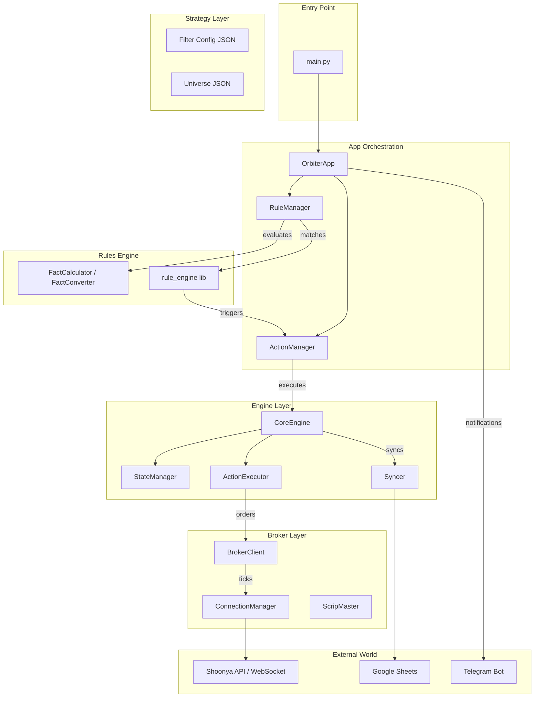

# 🏗 System Architecture

## Overview
ORBITER v3.0 follows a **Modular, Event-Driven Rules-Engine Architecture**. The system is driven by JSON-defined rules that evaluate facts and trigger actions. The core logic is decoupled from the broker implementation and the reporting layer.

## 🔄 High-Level Data Flow

## 🧩 Component Breakdown

### 1. Entry & Orchestration (`main.py`, `core/app.py`)
- **`main.py`**: Entry point. Bootstraps project, parses CLI args (`--simulation`, `--strategyId`), acquires lock, and launches OrbiterApp.
- **`OrbiterApp`**: Main orchestrator. Manages lifecycle (setup, login, prime_data), runs the main rule evaluation loop every 5 seconds, and hosts the reporting thread.

### 2. Rules Engine (`core/engine/rule/`)
The heart of the system - drives all decisions.
- **`RuleManager`**: Loads rules from JSON (`system_rules.json`, strategy rules). Uses `rule_engine` library to match facts against conditions. Returns a list of actions to execute.
- **`FactCalculator`**: Computes technical indicators (TA-Lib) and filter scores for each instrument. Merges strategy filter config with runtime data.
- **`FactConverter`**: Normalizes candle data from broker format to standard OHLCV format.
- **`TechnicalAnalyzer`**: Runs indicator calculations once per tick for efficiency.

### 3. Action System (`core/engine/action/`)
- **`ActionManager`**: Executes actions returned by RuleManager. Sorts by sequence, handles errors.
- **`RegistrationManager`**: Centralized registry that wires:
  - Actions (e.g., `app.login`, `engine.tick`, `trade.place_spread`) to ActionManager
  - Fact providers (session facts, portfolio facts) to RuleManager
- **`ActionExecutor`**: Routes order requests to specialized executors:
  - `EquityActionExecutor` / `EquitySimulationExecutor`
  - `OptionActionExecutor` / `OptionSimulationExecutor`
  - `FutureActionExecutor` / `FutureSimulationExecutor`
- **`Executors`**: Handle actual order placement. Simulation mode returns "OK" without placing real orders.

### 4. Engine Core (`core/engine/runtime/`)
- **`CoreEngine`**: The trading machine. Runs `tick()` which:
  1. Evaluates global rules
  2. Iterates through universe of symbols
  3. Calculates technical facts and scores
  4. Evaluates instrument-specific rules
  5. Executes resulting actions (place order, square off, alert)
- **`StateManager`**: Single source of truth. Holds:
  - Active positions, exit history, opening scores
  - Last scan metrics (for reporting)
  - Session persistence (cloud/local)

### 5. Broker Layer (`core/broker/`)
- **`BrokerClient`**: Unified facade for Shoonya API. Exposes `get_ltp()`, `place_order()`, `get_time_price_series()`, etc.
- **`ConnectionManager`**: Handles authentication (login/2FA) and WebSocket thread for live ticks.
- **`ScripMaster`**: Downloads and parses exchange master CSV files. Resolves Token ↔ Symbol mappings.
- **`OrderExecutor`**: Wraps Shoonya API order methods.
- **`MarginCalculator`**: Calculates SPAN margin for options/futures.

### 6. Session Management (`core/engine/session/`)
- **`SessionManager`**: Loads strategy configuration (from `strategy.json` + `filters.json`). Provides session facts (market open, trade window).
- **`StateManager`**: Manages trading state, position handover, and persistence.

### 7. Reporting & Notifications (`bot/`, `utils/`)
- **`Syncer`** (`core/engine/runtime/syncer.py`): Pushes active positions and state snapshots to Google Sheets.
- **`sheets.py`** (`bot/sheets.py`): gspread integration. Writes to `trade_log` spreadsheet:
  - `trade_log` tab: All executed trades
  - `active_positions` tab: Current open positions
  - `scan_metrics_{segment}` tab: Per-tick instrument scan results
- **`telegram_notifier.py`** (`utils/`): Telegram bot for commands (`/status`, `/pnl`, `/margin`, `/scan`, `/q`).
- **Reporting Thread**: OrbiterApp spawns a background thread that periodically (every 60s) publishes scan metrics and position updates to Google Sheets.

### 8. Configuration Layer (`config/`, `orbiter/config/`)
- **`system.json`**: Global settings (log level, paths).
- **`global_config.json`**: Strategy-wide parameters (trade score thresholds, risk limits).
- **`exchange_config.json`**: Segment-specific rules (MCX, NFO, BSE). Market hours, product types.
- **Strategy Bundle** (`orbiter/strategies/{strategy_id}/`):
  - `strategy.json`: Strategy name, exchange, entry/exit rules
  - `filters.json`: Filter configurations (enabled, thresholds, time periods)
  - `instruments.json`: Universe of symbols to scan

## 🔄 Execution Flow

1. **Startup**: `main.py` → `OrbiterApp` → `SessionManager` loads strategy
2. **Setup**: `app.setup` action → `EngineFactory` builds engine → `RegistrationManager` wires actions/facts
3. **Prime**: `app.prime_data` → Start WebSocket, load historical candles
4. **Main Loop** (every 5s):
   - `RuleManager.evaluate()` with context="global" → Global actions
   - For each symbol in universe:
     - Calculate technical facts (OHLCV → indicators → filter scores)
     - `RuleManager.evaluate_score()` → Compute trade score
     - `RuleManager.evaluate()` with context="instrument" → Instrument actions
     - `ActionManager.execute_batch()` → Execute trades/alerts
5. **Reporting**: Background thread pushes metrics to Google Sheets every 60s
6. **Shutdown**: Rule-driven (market close, EOD) or manual stop

## 📡 Notifications

- **Telegram**: Commands via `telegram_notifier.py`. Supports `/status`, `/pnl`, `/margin`, `/scan`, `/q` (AI query).
- **Google Sheets**: 
  - Scan metrics (instruments scanned, scores, filter results)
  - Trade log (entry/exit, P&L, margins)
  - Active positions (live updates)

## 🎯 Simulation vs Live

- **Simulation Mode** (`--simulation=true`): Executors return `{stat: "Ok", simulated: True}` without placing real orders.
- **Live Mode**: Actual order placement via Shoonya API. Controlled by `execute_trade` flag in strategy config.
