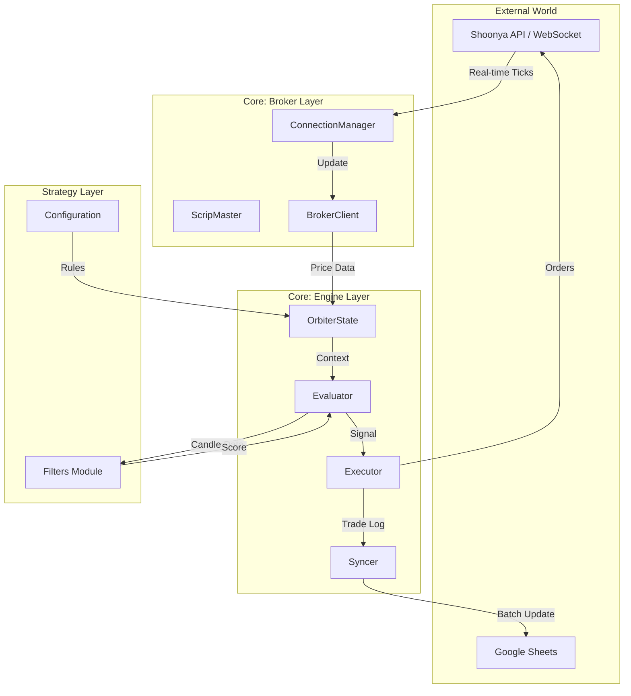

# 🏗 System Architecture

## Overview
ORBITER v3.0 follows a **Modular, Event-Driven Architecture**. The core logic is decoupled from the specific broker implementation and the reporting layer.

## 🔄 High-Level Data Flow

## 🧩 Component Breakdown

### 1. Broker Layer (`core/broker/`)
Handles all "plumbing" with the outside world.
- **`ConnectionManager`**: Manages Auth (Login/2FA) and the WebSocket thread.
- **`ScripMaster`**: Downloads and parses the massive CSV master files from the exchange to resolve Token <-> Symbol mappings.
- **`BrokerClient`**: A unified facade that exposes clean methods like `get_ltp()`, `place_order()`, and `get_time_price_series()`.

### 2. Engine Layer (`core/engine/`)
The "Brain" of the bot.
- **`OrbiterState`**: The Single Source of Truth. It holds the current configuration, active positions, and recent scan metrics. Passed to almost every function.
- **`Evaluator`**: The Analysis Engine. It fetches candles, normalizes them, and runs them through the Strategy Filters.
- **`Executor`**: The Decision Maker. It takes the scores from the Evaluator, ranks them, and decides whether to enter a trade based on risk limits.
- **`Syncer`**: The Reporter. Asynchronously pushes data to Google Sheets to avoid blocking the main trading loop.

### 3. Strategy Layer (`filters/`)
Pure functions that define *when* to trade.
- **`common/`**: Segment-agnostic logic (e.g., "Price > 5 EMA").
- **`sl/` & `tp/`**: Risk management logic (e.g., "Profit > 10%").

### 4. Configuration Layer (`config/`)
- **`main_config.py`**: Global strategy settings (Weights, Risk limits).
- **`exchange_config.py`**: Segment-specific rules (Market hours, Instruments).
